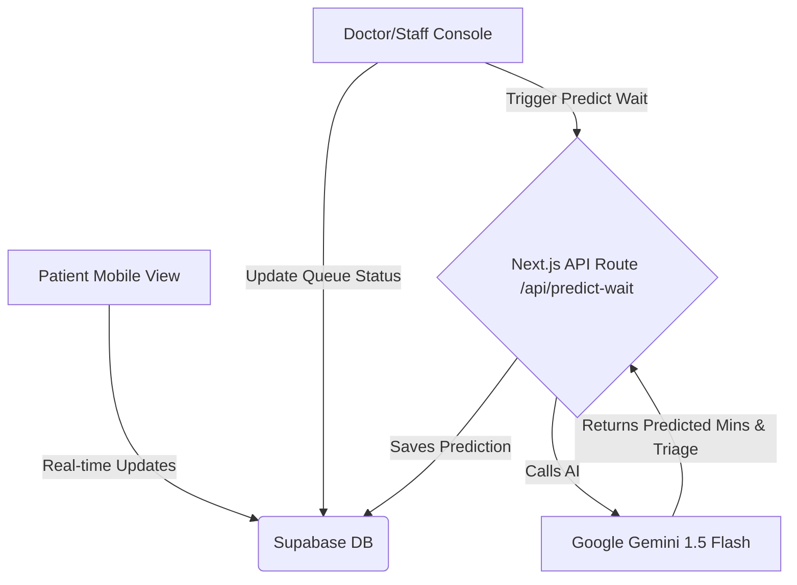

# ArogyaFlow (Adaptive OPD Queue Orchestrator)
**Track:** Track 3 – Jan Jeevan (Everyday Life & Public Health) or Track 1 – Access (Accessibility & Elderly inclusion)

**One-Line Pitch:** An intelligent hospital queue engine that eliminates OPD overcrowding by predicting case-weighted consultation times, adjusting for real-time doctor velocity, and keeping patients away from waiting rooms until their exact turn.

---

## 1. Minimal Viable Architecture (Zero-Bloat Setup)

---

## 2. Database Schema (Supabase)

We will create two main tables:

### Table 1: `doctors`
| Column | Type | Description |
| --- | --- | --- |
| `id` | `uuid / text` | Primary Key (e.g. `doc_general_medicine`) |
| `name` | `text` | e.g. "Dr. Anjali Sharma" |
| `department` | `text` | e.g. "General Medicine (Room 104)" |
| `current_token` | `int` | Current token being served (e.g. 61) |
| `velocity_factor` | `float` | Multiplier (Default: `1.0`; >1 means running slow) |
| `emergency_delay` | `int` | Extra delay in minutes (Default: `0`) |

### Table 2: `tokens`
| Column | Type | Description |
| --- | --- | --- |
| `token_number` | `int` | Sequential (62, 63, 64...) |
| `doctor_id` | `text` | Foreign key to `doctors` |
| `patient_name` | `text` | e.g. "Ramesh Kumar" |
| `chief_complaint` | `text` | e.g. "Follow-up blood test" vs "Severe chest pain" |
| `triage_level` | `text` | `routine` / `priority` / `express` |
| `predicted_mins` | `int` | AI-predicted duration (e.g. 4, 12, 18) |
| `status` | `text` | `waiting` / `in-consultation` / `completed` / `skipped` |
| `created_at` | `timestamp` | Time token was generated |

---

## 3. Hour-by-Hour 48-Hour Roadmap

### Phase 1: Foundation (Hours 0 – 8)
- **GitHub & Setup:** Initialize a Next.js + Tailwind project, push to a public GitHub repository, and deploy the skeleton to Vercel.
- **Database Init:** Set up a free Supabase project, create the `doctors` and `tokens` tables, and insert mock data for 10 patients ahead in the queue.
- **API Route:** Build `/api/predict-wait` that takes a complaint string and calls Gemini 1.5 Flash to return `predicted_mins` and `triage_level`.

### Phase 2: The Two Core Screens (Hours 8 – 24)
- **Screen 1: Patient Live Tracker (Mobile View)**
  - A clean, clutter-free mobile view.
  - Giant card showing:
    - Current Token Serving: #61 vs Your Token: #75
    - Patients Ahead: 14
    - Dynamic Estimated Wait: ~38 mins (Estimated: 11:45 AM)
  - Status Badge:
    - 🟢 Relax / Outside: > 15 mins away.
    - 🟡 Buffer Zone (Move to Room 104): 3 tokens away.
    - 🔴 Inside Room Now: Current token.
- **Screen 2: Doctor / Receptionist Console (Desktop View)**
  - List of incoming tokens with their AI-predicted durations.
  - Three critical action buttons:
    1. Call Next Token (Advances queue, marks previous token as completed).
    2. Mark Emergency Delay (+15m) (Instantly recalculates all patient wait times).
    3. Mark No-Show / Skip (Passes token without stalling the queue).

### Phase 3: Real-Time Sync & Smart Polish (Hours 24 – 36)
- Connect Supabase Realtime listeners (`on('postgres_changes')`) so when the doctor clicks "Next", the patient's phone updates in real time without refreshing.
- Add audio readout fallback for low-literacy patients using browser `speechSynthesis` (e.g. "Token 75, aapka samay lagbhag 40 minute bacha hai.").

### Phase 4: Submission Package Prep (Hours 36 – 46)
- **Slide Deck:** Complete the 6 required slides according to the hackathon guidelines.
- **Demo Video:** Record the 3-minute video using Loom or OBS.
- **GitHub README:** Add setup instructions, tech stack list, and architecture diagram.

### Phase 5: Submission & Buffer (Hours 46 – 48)
- Submit the PPT, public GitHub link, Vercel prototype link, and 3-minute video on Unstop at least 2 hours before the deadline.

---

## 4. The 3-Minute Video Script (Demo Walkthrough)

| Timestamp | Screen | Voiceover / Script |
| --- | --- | --- |
| 0:00 – 0:40 | Slide 2 (Problem) + Overcrowded OPD photo | "In Indian civil hospital OPDs, patients wait 3 to 4 hours in crowded waiting halls because traditional token systems only tell them their number, not their wait time..." |
| 0:40 – 1:30 | Patient Mobile Screen | "Here is ArogyaFlow. A patient receives Token #75. Instead of a flat formula, our AI evaluates the specific symptoms of all 14 patients ahead..." |
| 1:30 – 2:20 | Doctor Screen & Patient Screen side-by-side | "Now watch what happens when an emergency trauma case enters. The doctor clicks 'Emergency Delay +15m'. Instantly, without refreshing, Token #75's phone updates..." |
| 2:20 – 2:45 | Audio / Voice feature | "For rural and elderly citizens, a single tap reads out the status in Hindi using browser text-to-speech." |
| 2:45 – 3:00 | Slide 5 (Impact & Scale) | "ArogyaFlow requires no hardware, runs as a lightweight PWA on any phone, and converts chaotic waiting rooms into orderly, predictable OPDs." |

---

## 5. Slide Deck Content (Strict 6 Slides)

1. **Title Slide:** Project: ArogyaFlow | Track: Track 3 – Jan Jeevan | One-liner.
2. **Problem Statement:** OPD bottlenecks in India, unpredictable wait times, infection risks, lost daily wages.
3. **Solution:** Dynamic queue management with case-weighted duration prediction, doctor drift tracking, and a 3-tier buffer alert system.
4. **Technology & Implementation:** Next.js, Supabase Realtime, Gemini 1.5 Flash API, Web Speech API, system architecture flowchart.
5. **Feasibility, Scalability & Impact:** Zero hospital hardware investment needed; scalable to civil, district, and private clinics.
6. **Prototype & Future Scope:** Working Vercel URL, public GitHub link, screenshots of the dual dashboard, and future scope (WhatsApp bot & ABDM/ABHA integration).
