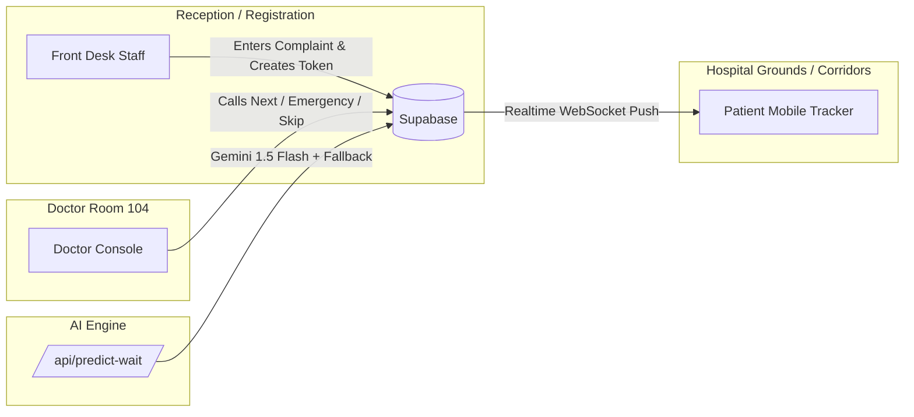
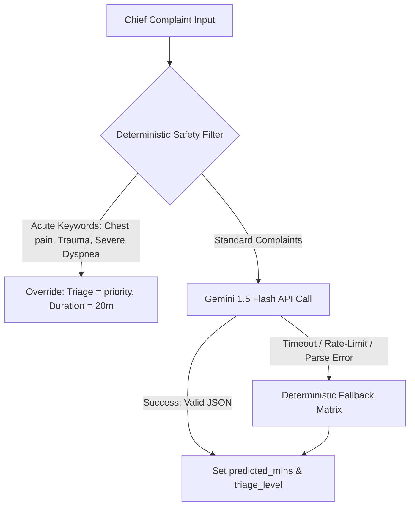
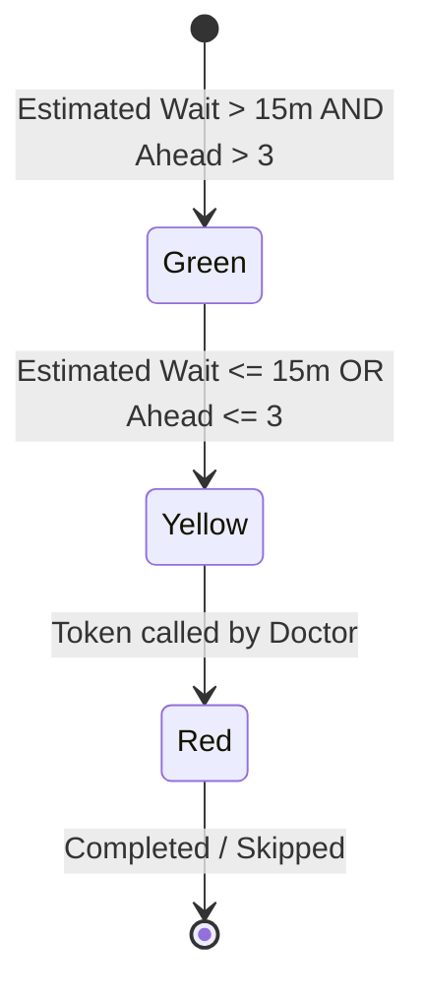
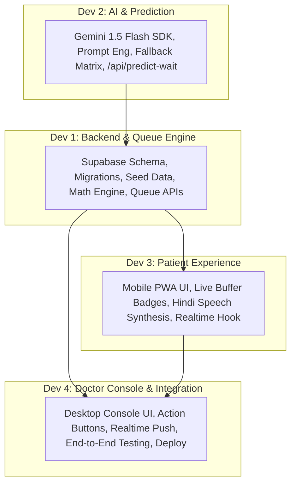
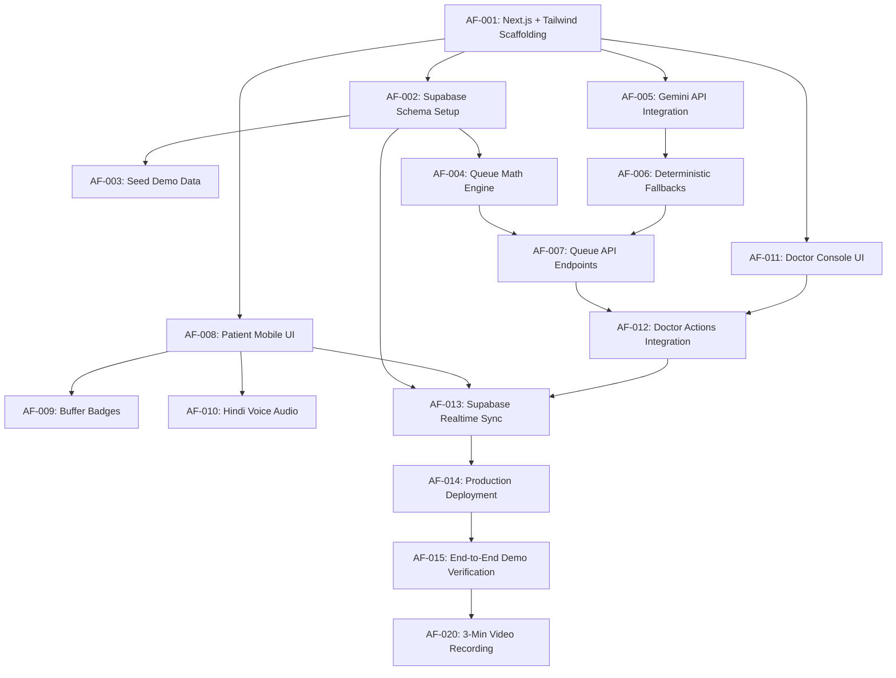

# ArogyaFlow — Product Requirements Document (PRD) & Team Implementation Blueprint

**Project Name:** ArogyaFlow (Adaptive OPD Queue Orchestrator)  
**Hackathon Track:** Track 3 – Jan Jeevan (Everyday Life & Public Health)  
**Shared Source of Truth:** Version 1.0.0 (4-Developer 48-Hour Master Specification)  
**Target Repository:** `Anish-Valke/BnB-project`

---

## 1. Project Overview

### 1.1 One-Line Pitch
An intelligent hospital queue engine that eliminates Outpatient Department (OPD) overcrowding by predicting case-weighted consultation times, adjusting dynamically using real-time doctor velocity, and keeping patients comfortably away from infection-prone waiting rooms until their exact turn.

### 1.2 Problem Context & Public Health Vision
In India’s civil, district, and tertiary hospitals, Outpatient Departments are overwhelmed daily by hundreds of patients. Under standard token systems, patients arrive early in the morning and sit in congested, poorly ventilated corridors for 3 to 5 hours because their slip displays only a flat serial number (e.g., `#75`). Patients fear missing their turn if they leave the hallway, leading to:
- Dangerous waiting-hall overcrowding and elevated cross-infection risks (e.g., respiratory infections, TB).
- Severe physical strain on elderly, mobility-impaired, and pregnant patients.
- Lost daily wages and productivity for daily-wage laborers and accompanying caregivers.
- Extreme workplace stress and agitation directed at healthcare staff.

ArogyaFlow reimagines the OPD queue as a distributed, transparent, and predictable flow. Patients receive live queue intelligence on their basic mobile browsers, allowing them to wait in open-air gardens, hospital cafeterias, or nearby resting zones until the system signals their buffer window.

### 1.3 Target Users
1. **General OPD Patients & Families:** Visitors needing clear, anxiety-free timelines without having to camp at the consultation door.
2. **Elderly & Low-Literacy Patients:** Individuals requiring high-contrast, large-format interfaces, zero cognitive clutter, and vernacular audio readout in Hindi (`speechSynthesis`).
3. **OPD Doctors & Clinical Staff:** Physicians who need a frictionless 1-click console to call next tokens, signal emergency interruptions, or mark no-shows without administrative overhead.
4. **Hospital Receptionists & Triage Nurses:** Front-desk staff generating digital tokens based on simple presenting complaints.

### 1.4 Product Goals (MVP)
- **Dynamic Case-Weighted Prediction:** Replace static "5 mins per patient" estimates with symptom-aware predicted consultation times powered by Gemini 1.5 Flash and clinical fallback rules.
- **Velocity & Delay Recalibration:** Continuously adjust remaining wait times using the doctor’s actual consultation pace and sudden emergency delay additions.
- **3-Tier Spatial Buffer System:** Categorize each patient's position into Green (Relax / Outside), Yellow (Buffer Zone / Near Room), and Red (Now Serving / Inside Room).
- **Zero-Latency Realtime Synchronization:** Push queue state changes across doctor consoles and patient screens instantly using Supabase Realtime without manual browser refreshing.
- **Built-In Accessibility:** Integrate 1-tap Hindi voice readouts, ultra-legible typography, high-contrast badges, and screen-reader compliant semantic HTML.

### 1.5 Non-Goals (Out of Scope for 48-Hour Hackathon)
- No automated medical diagnosis, clinical prescriptions, or clinical triage decision-making.
- No electronic medical records (EMR) or full EHR management.
- No payment gateway or billing integrations.
- No SMS/WhatsApp gateway setup (planned for post-hackathon future scope; simulated in local UI if needed).

---

## 2. Problem Statement (Everyday Public Healthcare Perspective)

Standard OPD token systems communicate one static scalar value:
```text
Your Token: #75
```
Patients lack critical operational visibility:
- *How many patients are physically ahead?*
- *Is the doctor running fast or behind schedule?*
- *Did an emergency trauma case just push back the entire room?*
- *Should an elderly grandmother sit on a concrete bench for 2 hours or rest comfortably outside in the courtyard?*

This information vacuum triggers herd behavior: patients crowd the physical door to peer through the glass, argue with peons, and block corridor movement. ArogyaFlow solves this transparency gap by delivering deterministic, recalculating wait times directly into the citizen's pocket.

---

## 3. The Solution Architecture

ArogyaFlow transforms an opaque token slip into a real-time status beacon:

```text
┌─────────────────────────────────────────────────────────┐
│                      ArogyaFlow                         │
│               General Medicine - Room 104               │
├─────────────────────────────────────────────────────────┤
│  YOUR TOKEN                                             │
│  #75                                                    │
│                                                         │
│  NOW SERVING               PATIENTS AHEAD               │
│  #61                       14                           │
│                                                         │
│  ESTIMATED WAIT            EXPECTED TURN                │
│  ~38 mins                  11:45 AM                     │
│                                                         │
│  STATUS                                                 │
│  🟢 RELAX / OUTSIDE — You can comfortably wait outside  │
│                                                         │
│  [ 🔊 सुनें (Listen Status) ]                           │
└─────────────────────────────────────────────────────────┘
```

The system recalculates the entire queue dynamically whenever:
1. A doctor marks a patient consultation as `completed`.
2. A doctor marks a patient as `skipped` (no-show).
3. An emergency case pauses regular consultations (`+15 mins delay`).
4. Doctor velocity drifts (consultations taking longer or shorter than predicted).
5. A high-priority acute patient is inserted into the queue.

---

## 4. User Types & Screen Breakdown



### 4.1 Screen 1: Patient Live Tracker (Mobile View)
- **Viewport:** Mobile-optimized PWA layout (360px – 480px width).
- **Core Elements:**
  - Token Header: Department, Room Number, Doctor Name.
  - Primary Display: Patient Token (`#75`) vs Currently Serving (`#61`).
  - Queue Metrics: Patients Ahead (`14`), Estimated Wait Time (`~38 mins`), Estimated Turn (`11:45 AM`).
  - Visual Buffer Badge: Color + Icon + Explicit text instruction.
  - Accessibility Audio Action: Prominent `🔊 सुनें` button activating Hindi speech readout.
  - Live Connection Status Indicator: Green dot showing active WebSocket connection.

### 4.2 Screen 2: Doctor / Receptionist Console (Desktop/Tablet View)
- **Viewport:** Responsive grid (1024px+ desktop/tablet).
- **Core Elements:**
  - Active Patient Spotlight: Name, Token Number, Chief Complaint, Triage Level, Duration Elapsed vs Predicted.
  - Primary Action Cluster:
    1. `Call Next Token`: Concludes current token, activates next sequential token, triggers recalculations.
    2. `Emergency Delay (+15m)`: Injects +15m overhead onto the queue, instantly updating all waiting screens.
    3. `Skip / No-Show`: Bypasses non-responsive patient, moves queue forward without penalty.
  - Live Queue Roster: Chronological list of upcoming patients with predicted minutes and triage badges.
  - Doctor Velocity Monitor: Indicates real-time multiplier (e.g., `1.15x Pace`).

---

## 5. Accessibility & Elderly-Friendly Design (Core MVP Requirement)

Accessibility is a fundamental pillar of ArogyaFlow’s product architecture. Civil hospital attendees include elderly grandparents, villagers, and individuals with visual or literacy limitations.

### 5.1 Design Directives
1. **Ultra-Large Typography:**
   - Token numbers displayed at minimum `text-5xl` (3rem / 48px) bold.
   - Wait times displayed at minimum `text-3xl` (1.875rem / 30px) semi-bold.
2. **High-Contrast Triple Encoding:**
   - Status is **never** communicated by color alone. Every badge combines:
     - 🎨 Visual Color Background & Border
     - 🔣 Universal Icon (Sun/Relax, Alert/Walking, Bell/Entering)
     - 📝 Explicit Plain-Language Action Text
3. **Touch-Target Ergonomics:**
   - All interactive touch targets must exceed `48px × 48px` (primary buttons at `56px` height) with ample padding for trembling or unsteady hands.
4. **Zero-Cognitive Load (Zero Interactions Required):**
   - The patient screen requires **zero taps** to discover status. It loads directly via URL/QR code and listens silently over WebSockets.
5. **Hindi Voice Guidance (Web Speech API):**
   - Single prominent `🔊 सुनें` button triggers browser-native `window.speechSynthesis`.
   - Script dynamically renders queue state into natural Hindi:
     > *"टोकन नंबर 75, आपके आगे 14 मरीज हैं। आपका अनुमानित समय लगभग 38 मिनट बचा है। आप आराम से बाहर बैठ सकते हैं।"*
   - Voice parameter fallback: matches `hi-IN` voices, falls back smoothly to device default if unavailable.

---

## 6. Core Queue System & Database Schema

The database utilizes **Supabase (PostgreSQL)** with Row-Level Security (RLS) and Realtime replication enabled on both tables.

### 6.1 Table: `doctors`
Stores doctor identity, physical location, active state, and queue velocity parameters.

```sql
CREATE TABLE doctors (
    id TEXT PRIMARY KEY,                       -- e.g. 'doc_general_medicine_104'
    name TEXT NOT NULL,                        -- e.g. 'Dr. Anjali Sharma'
    department TEXT NOT NULL,                  -- e.g. 'General Medicine'
    room_number TEXT NOT NULL,                 -- e.g. 'Room 104'
    current_token INT DEFAULT 0,               -- Token currently inside room
    velocity_factor FLOAT DEFAULT 1.0,         -- Pace multiplier (>1.0 slower, <1.0 faster)
    emergency_delay INT DEFAULT 0,             -- Accumulated emergency delay in minutes
    updated_at TIMESTAMPTZ DEFAULT NOW()
);
```

### 6.2 Table: `tokens`
Stores patient arrival, complaint details, AI-predicted times, and lifecycle states.

```sql
CREATE TYPE token_status AS ENUM ('waiting', 'in-consultation', 'completed', 'skipped');
CREATE TYPE triage_level AS ENUM ('routine', 'priority', 'express');

CREATE TABLE tokens (
    id UUID PRIMARY KEY DEFAULT gen_random_uuid(),
    token_number INT NOT NULL,                 -- Sequential: 61, 62, 63...
    doctor_id TEXT REFERENCES doctors(id),
    patient_name TEXT NOT NULL,                -- e.g. 'Ramesh Kumar'
    chief_complaint TEXT NOT NULL,             -- e.g. 'Blood pressure follow-up'
    triage_level triage_level DEFAULT 'routine',
    predicted_mins INT NOT NULL DEFAULT 8,     -- AI prediction or fallback (mins)
    status token_status DEFAULT 'waiting',
    created_at TIMESTAMPTZ DEFAULT NOW(),
    consultation_started_at TIMESTAMPTZ,
    consultation_completed_at TIMESTAMPTZ
);

CREATE INDEX idx_tokens_doctor_status ON tokens(doctor_id, status, token_number);
```

### 6.3 Schema Decision Rationale
- Kept strictly to 2 tables to eliminate join overhead during 48-hour hackathon execution.
- Added `consultation_started_at` and `consultation_completed_at` to allow the calculation of actual doctor velocity without unnecessary complexity.
- Avoided separate medical records tables; all hackathon data is simulated/mock data.

---

## 7. AI Prediction & Clinical Safety Fallback

### 7.1 Objective & Boundary
Gemini 1.5 Flash is strictly utilized as an **operational time estimator**, not a clinical diagnostic tool. It predicts the expected consultation duration based on administrative and clinical communication complexity.

### 7.2 Safety Architecture: Dual-Layer Pipeline



### 7.3 Deterministic Safety Override Rules
Certain presentations require immediate medical escalation and predictable duration buffers. If complaint strings match regex triggers:
- `chest pain`, `bleeding`, `unconscious`, `acute breathlessness`: Override to `triage_level = 'priority'`, `predicted_mins = 20`.
- `follow-up`, `report check`, `bp check`, `refill`: Override to `triage_level = 'express'`, `predicted_mins = 4`.

### 7.4 Gemini 1.5 Flash Prompt Specification
```text
System: You are an expert hospital OPD operational flow analyzer. Estimate the expected consultation duration in integer minutes (between 3 and 25) and assign an operational triage level ('express', 'routine', 'priority') based on patient complaint complexity. Return strictly valid JSON.

Input: "Follow-up blood test and routine sugar check"
Output:
{
  "predicted_mins": 5,
  "triage_level": "express",
  "reasoning": "Routine follow-up reviewing existing laboratory values"
}
```

### 7.5 Deterministic Fallback Matrix
If Gemini API encounters a 429, 500, network drop, or latency > 2500ms, the system falls back seamlessly to:
- Express (Follow-up / Reports): 5 mins
- Routine (Fever, Cough, General Ache): 8 mins
- Priority / Complex (Chronic Multi-symptom, Abdominal Pain): 15 mins
- Unknown / Unspecified: 8 mins default

---

## 8. Wait-Time & Velocity Algorithm

### 8.1 Mathematical Formula

For any patient with token $T_{target}$ waiting for doctor $D$:

$$\text{Estimated Wait (mins)} = \left( \sum_{i \in \text{Waiting Ahead}} \text{predicted\_mins}_i + \text{Remaining Active Time} \right) \times \text{velocity\_factor} + \text{emergency\_delay}$$

Where:
- $\text{Waiting Ahead}$: All tokens assigned to doctor $D$ where $\text{status} = \text{'waiting'}$ and $\text{token\_number} < T_{target}$.
- $\text{Remaining Active Time}$: For the currently serving token ($\text{status} = \text{'in-consultation'}$):
  $$\max\left(1, \text{predicted\_mins} - \Delta t_{\text{elapsed}}\right)$$
- $\text{velocity\_factor}$: Ratio of actual consultation durations vs predicted durations over the last 3 completed patients:
  $$\text{velocity\_factor} = \text{clamp}\left(0.75, \frac{\sum \text{actual\_duration}}{\sum \text{predicted\_mins}}, 1.5\right)$$
  *(Default is 1.0; a factor of 1.25 indicates the doctor is spending 25% more time per patient).*
- $\text{emergency\_delay}$: Accumulated manual delays added by the doctor (in minutes).

### 8.2 Worked Concrete Example
- Doctor: Dr. Anjali Sharma (`velocity_factor = 1.1`, `emergency_delay = 15`)
- Currently Serving: Token #61 (Predicted: 10 mins, Elapsed: 6 mins $\rightarrow$ Remaining: 4 mins)
- Target Patient: Token #64
- Intermediate Queue:
  - Token #62 (Routine cold/fever): Predicted 8 mins
  - Token #63 (Suture removal): Predicted 6 mins
- Calculation:
  $$\text{Base Ahead} = 4\text{m (active remaining)} + 8\text{m} + 6\text{m} = 18\text{ mins}$$
  $$\text{Adjusted Wait} = (18 \times 1.1) + 15 = 19.8 + 15 = 34.8 \approx \mathbf{35\text{ minutes}}$$

---

## 9. 3-Tier Spatial Buffer System

To eliminate physical corridor waiting without causing missed appointments, ArogyaFlow employs a **Dual-Condition Threshold**:



| Badge | Status Key | Criteria | Patient Instruction | Visual Styling |
| :--- | :--- | :--- | :--- | :--- |
| 🟢 | **RELAX / OUTSIDE** | Wait $> 15$ mins **AND** $> 3$ tokens ahead | *"You can wait outside in the open garden or cafeteria. We will alert you when your window nears."* | Emerald green border, soft green glow, sun/bench icon. |
| 🟡 | **BUFFER ZONE** | Wait $\le 15$ mins **OR** $\le 3$ tokens ahead | *"Move toward Room 104 now. Prepare your documents."* | Amber yellow border, subtle pulse animation, walking icon. |
| 🔴 | **INSIDE ROOM NOW** | $\text{token\_number} == \text{current\_token}$ | *"Please enter Room 104 immediately. The doctor is calling you."* | Crimson red border, distinct ringing bell icon, audio chime. |

---

## 10. Realtime Architecture (Supabase WebSockets)

```text
[Doctor Console]
       │
       ▼ (1) POST /api/queue/doc_104/next
[Next.js API Route]
       │
       ▼ (2) UPDATE tokens SET status='completed'... UPDATE doctors SET current_token=62...
[Supabase PostgreSQL]
       │
       ├────────────────────────────────────────┐
       ▼ (3) WAL change captured                ▼
[Supabase Realtime Engine]                      [Database State]
       │
       ▼ (4) WebSocket Broadcast ('postgres_changes')
[Patient Mobile Tracker Screen]
       │
       ▼ (5) React state updates: recalculates Wait Time, ETA, and Buffer Badge instantly!
```

- Connection Resilience: If a patient loses network connectivity in an elevator or basement, Supabase auto-reconnects with exponential backoff and triggers an immediate state re-fetch.
- Latency target: UI state update reflected across mobile devices in $< 350\text{ms}$.

---

## 11. API Specifications

All endpoints are built as Next.js App Router API routes (`app/api/...`).

### 11.1 `POST /api/predict-wait`
- **Purpose:** Analyzes a presenting complaint and outputs duration + triage.
- **Request Body:**
  ```json
  { "complaint": "Persistent dry cough and mild fever for 3 days" }
  ```
- **Response Body (200 OK):**
  ```json
  {
    "predicted_mins": 8,
    "triage_level": "routine",
    "source": "gemini-1.5-flash"
  }
  ```
- **Error Response (Fallback 200 OK with flag):**
  ```json
  {
    "predicted_mins": 8,
    "triage_level": "routine",
    "source": "deterministic-fallback"
  }
  ```

### 11.2 `GET /api/queue/[doctorId]`
- **Purpose:** Fetches complete queue status for a specific doctor.
- **Response Body (200 OK):**
  ```json
  {
    "doctor": {
      "id": "doc_general_medicine_104",
      "name": "Dr. Anjali Sharma",
      "room_number": "Room 104",
      "current_token": 61,
      "velocity_factor": 1.05,
      "emergency_delay": 0
    },
    "queue": [
      {
        "token_number": 61,
        "patient_name": "Suresh Gupta",
        "chief_complaint": "Acute migraine",
        "predicted_mins": 12,
        "status": "in-consultation"
      },
      {
        "token_number": 62,
        "patient_name": "Pooja Verma",
        "chief_complaint": "Routine BP check",
        "predicted_mins": 4,
        "status": "waiting"
      }
    ]
  }
  ```

### 11.3 `POST /api/queue/[doctorId]/next`
- **Purpose:** Concludes active token, advances `current_token`, updates timestamps.
- **Request Body:** `{}`
- **Database Action:**
  - Sets token with `status = 'in-consultation'` to `status = 'completed'`, `consultation_completed_at = NOW()`.
  - Increments `doctors.current_token` by 1.
  - Sets next token to `status = 'in-consultation'`, `consultation_started_at = NOW()`.
- **Response Body (200 OK):**
  ```json
  { "success": true, "current_token": 62 }
  ```

### 11.4 `POST /api/queue/[doctorId]/emergency`
- **Purpose:** Injects or resets emergency delay time.
- **Request Body:**
  ```json
  { "delay_mins": 15 }
  ```
- **Database Action:**
  - Adds `delay_mins` to `doctors.emergency_delay`.
- **Response Body (200 OK):**
  ```json
  { "success": true, "total_emergency_delay": 15 }
  ```

### 11.5 `POST /api/queue/[doctorId]/skip`
- **Purpose:** Marks a patient as absent/skipped without halting queue flow.
- **Request Body:**
  ```json
  { "token_number": 62 }
  ```
- **Database Action:**
  - Sets token `status = 'skipped'`.
  - Calls next available token into consultation.
- **Response Body (200 OK):**
  ```json
  { "success": true, "skipped_token": 62, "new_active_token": 63 }
  ```

### 11.6 `POST /api/tokens`
- **Purpose:** Generates a new patient token at reception.
- **Request Body:**
  ```json
  {
    "doctor_id": "doc_general_medicine_104",
    "patient_name": "Radha Devi",
    "chief_complaint": "Joint pain in knees"
  }
  ```
- **Response Body (201 Created):**
  ```json
  {
    "token_number": 76,
    "predicted_mins": 10,
    "triage_level": "routine",
    "estimated_wait_mins": 42
  }
  ```

---

## 12. Security & Data Integrity Directives

1. **Server-Side API Key Isolation:** The `GEMINI_API_KEY` and Supabase `SERVICE_ROLE_KEY` exist solely in server runtime environments (`process.env`). They are never prefixed with `NEXT_PUBLIC_`.
2. **Restricted Client Scope:** Patient mobile screens access Supabase using the read-only `NEXT_PUBLIC_SUPABASE_ANON_KEY` scoped strictly via PostgreSQL Row Level Security (RLS) to read active tokens.
3. **No Real Protected Health Information (PHI):** The system stores only mock first names and generalized operational complaints (e.g., "Routine checkup", "Joint pain"). No phone numbers, government IDs (Aadhaar), or diagnostic histories are persisted in this hackathon build.
4. **Clinical Disclaimer:** Clear footer notice on all views: *"ArogyaFlow provides administrative wait estimates only. For clinical emergencies, approach hospital triage staff immediately."*

---

## 13. Four-Developer Work Allocation & Ownership

Every task in ArogyaFlow has **exactly one primary owner** to prevent merge collisions and maximize delivery speed across 48 hours.



### 13.1 Developer 1: Backend, Database & Queue Engine
- **Branch:** `feature/backend-queue-engine`
- **Core Scope:**
  - Supabase database schema, RLS policies, migrations, and deterministic seed script.
  - Queue mathematical calculation engine (`lib/queue-calculator.ts`).
  - Next.js API route handlers (`/api/queue/*` and `/api/tokens`).
  - Velocity calculation and emergency delay accumulation logic.

### 13.2 Developer 2: AI Engine & Fallback Architecture
- **Branch:** `feature/ai-prediction`
- **Core Scope:**
  - Google Gemini 1.5 Flash integration using `@google/genai` or `@google/generative-ai`.
  - Structured JSON prompting and response validation schema.
  - Deterministic clinical safety rule overrides (acute keyword detection).
  - Robust offline fallback matrix and automated resilience tests.

### 13.3 Developer 3: Patient Experience & Accessibility Lead
- **Branch:** `feature/patient-experience`
- **Core Scope:**
  - Mobile-first responsive patient tracking view (`app/patient/[token]/page.tsx`).
  - High-contrast 3-Tier status badges (Green / Yellow / Red).
  - Browser `speechSynthesis` Hindi audio reader component.
  - Client-side Supabase Realtime subscription hooks (`useQueueRealtime`).

### 13.4 Developer 4: Doctor Console, Integration & Deployment Lead
- **Branch:** `feature/doctor-console`
- **Core Scope:**
  - Doctor & staff queue management console (`app/doctor/page.tsx`).
  - Action button triggers (`Call Next`, `Emergency Delay +15m`, `Skip`).
  - Multi-screen real-time integration validation.
  - Vercel production deployment pipeline and final presentation assets.

---

## 14. Master Task Matrix

| ID | Task Description | Owner | Priority | Dependencies | Est. Effort | Definition of Done |
| :--- | :--- | :--- | :--- | :--- | :--- | :--- |
| **AF-001** | Next.js 14 + Tailwind + Lucide repository scaffolding | Dev 4 | **P0** | None | 1.5h | Project builds clean with zero lint warnings. |
| **AF-002** | Supabase database schema & RLS setup | Dev 1 | **P0** | AF-001 | 2.0h | `doctors` and `tokens` tables created with test rows. |
| **AF-003** | Deterministic 15-patient seed data script | Dev 1 | **P0** | AF-002 | 1.0h | Running `pnpm seed` populates demo queue #61–#75. |
| **AF-004** | Queue math calculation library | Dev 1 | **P0** | AF-002 | 2.5h | Unit-tested formulas for wait time, velocity, delay. |
| **AF-005** | Gemini 1.5 Flash API route `/api/predict-wait` | Dev 2 | **P0** | AF-001 | 2.5h | Returns predicted duration JSON from complaint string. |
| **AF-006** | Deterministic fallback & acute keyword override | Dev 2 | **P0** | AF-005 | 1.5h | Simulated API failure defaults safely to fallback matrix. |
| **AF-007** | Core Queue Management APIs (`/next`, `/emergency`, `/skip`) | Dev 1 | **P0** | AF-004 | 3.0h | Endpoints successfully modify database states. |
| **AF-008** | Patient Mobile Tracker base screen | Dev 3 | **P0** | AF-001 | 3.0h | Displays token, current serving, ETA, and metrics. |
| **AF-009** | 3-Tier Buffer Badge component (Green/Yellow/Red) | Dev 3 | **P0** | AF-008 | 1.5h | Switches visual styles correctly based on wait thresholds. |
| **AF-010** | Hindi Voice Synthesis module (`🔊 सुनें`) | Dev 3 | **P0** | AF-008 | 2.0h | Speaks fluent queue update in Hindi via browser audio. |
| **AF-011** | Doctor Console UI layout & queue table | Dev 4 | **P0** | AF-001 | 3.5h | Renders active token and upcoming queue list. |
| **AF-012** | Doctor Console action buttons wiring | Dev 4 | **P0** | AF-007, AF-011 | 2.0h | Clicks invoke backend APIs and reflect immediately. |
| **AF-013** | Supabase Realtime WebSocket listener on Patient UI | Dev 3 | **P0** | AF-002, AF-008 | 2.5h | Doctor clicking "Next" updates Patient screen $< 500\text{ms}$. |
| **AF-014** | Vercel deployment & environment variable configuration | Dev 4 | **P0** | AF-012, AF-013 | 1.5h | Production URL functioning on live mobile devices. |
| **AF-015** | End-to-end integration & demo rehearsal verification | All | **P0** | AF-014 | 3.0h | Flawless execution of 3-minute video demo scenario. |
| **AF-016** | Doctor velocity auto-recalculation hook | Dev 1 | **P1** | AF-004 | 2.0h | Velocity factor updates as completed times log. |
| **AF-017** | Front-desk patient registration modal | Dev 4 | **P1** | AF-005, AF-007 | 2.0h | Allows adding Token #76 via live interface. |
| **AF-018** | High-contrast visual toggle mode | Dev 3 | **P2** | AF-008 | 1.0h | Maximizes contrast ratio to 7:1 for low-vision users. |
| **AF-019** | Hackathon 6-Slide presentation deck preparation | Dev 4 | **P0** | None | 3.0h | Clean, polished slides covering problem, tech, impact. |
| **AF-020** | 3-minute video recording & editing | All | **P0** | AF-015, AF-019 | 3.0h | Screen recording + narration matching script. |

---

## 15. Dependency Graph



### Critical Path Analysis
1. **Scaffold (AF-001)** $\rightarrow$ **DB (AF-002)** $\rightarrow$ **Math & API (AF-004, AF-007)** $\rightarrow$ **Realtime (AF-013)** $\rightarrow$ **Deployment (AF-014)**.
2. Any delay in AF-002 or AF-007 blocks both frontend developers from completing Realtime synchronization.

---

## 16. 48-Hour Execution Plan (Hour-by-Hour Matrix)

| Timeframe | Dev 1 (Backend/Queue) | Dev 2 (AI/Prediction) | Dev 3 (Patient/Access) | Dev 4 (Doctor/Deploy) |
| :--- | :--- | :--- | :--- | :--- |
| **Hours 0–4** | Create Supabase project; build SQL migrations for `doctors` & `tokens`. | Set up Gemini API client; write system prompt for triage. | Wireframe Patient Mobile screen; define theme & typography. | Scaffold Next.js project with Tailwind; configure Git repo. |
| **Hours 4–8** | Write seed script (`pnpm seed`) with deterministic demo patients. | Implement deterministic keyword safety overrides. | Implement static Patient Mobile UI cards with large typography. | Build Doctor Console desktop grid; deploy initial skeleton to Vercel. |
| **Hours 8–12** | Code `calculateWaitTime()` library with velocity & emergency logic. | Build Next.js API route `/api/predict-wait` with JSON validation. | Build 3-Tier Buffer Badge component with icons and explicit text. | Create Doctor queue table component showing upcoming patient tokens. |
| **Hours 12–16** | Build `/api/queue/[id]/next` and `/api/queue/[id]/emergency` APIs. | Write mock fallback matrix when Gemini API fails or times out. | Integrate Web Speech API for Hindi voice readout (`🔊 सुनें`). | Implement Doctor action buttons (`Next`, `Emergency +15m`, `Skip`). |
| **Hours 16–20** | Write `/api/queue/[id]/skip` and `/api/tokens` creation endpoints. | Unit-test Gemini edge cases (unusual complaints, empty strings). | Add high-contrast mode; test responsiveness on small mobile devices. | Wire Doctor action buttons to backend APIs; verify DB mutations. |
| **Hours 20–24** | Verify database transactions; configure Supabase Realtime publication. | Assist Dev 1 with integrating `/predict-wait` into `/tokens` API. | Hook up Supabase Realtime channel to auto-update patient state. | Connect Doctor console to Realtime events; verify bi-directional sync. |
| **Hours 24–28** | **MILESTONE REVIEW:** Core loop validation (Doctor clicks Next $\rightarrow$ Patient updates). Fix any latency or race conditions. | | | |
| **Hours 28–32** | Build doctor velocity rolling average calculator from timestamps. | Test AI latency under simulated slow network conditions. | Fine-tune Hindi pronunciation and dynamic string generation. | Build registration modal for adding new patients on the fly. |
| **Hours 32–36** | Stress-test concurrent queue requests; optimize DB queries. | Verify all clinical fallbacks trigger accurately on medical keywords. | Polish micro-interactions, badge pulsing animations, and audio icons. | Audit full UI on real mobile devices (Android Chrome, iOS Safari). |
| **Hours 36–40** | Freeze code. Write backend test scripts for live demo stability. | Assist with presentation deck; draft AI architecture diagrams. | Assist with presentation deck; document accessibility metrics. | Prepare Slide Deck (6 slides strict); set up recording environment. |
| **Hours 40–44** | Rehearse demo walkthrough. Run deterministic seed reset before each dry run. | | | Record 3-minute screen demo with voiceover matching script. |
| **Hours 44–48** | Final deployment verification on Vercel; submit Unstop package 2 hours prior to deadline. Buffer window for any platform hiccups. | | | |

---

## 17. GitHub Workflow & Collaboration Rules

### 17.1 Branching Strategy
- `main`: Production-ready code only. Automatically deployed to Vercel production on merge.
- `develop`: Primary integration branch. All feature branches merge here via PR.
- `feature/*`: Individual developer branches:
  - `feature/backend-queue-engine` (Dev 1)
  - `feature/ai-prediction` (Dev 2)
  - `feature/patient-experience` (Dev 3)
  - `feature/doctor-console` (Dev 4)

### 17.2 Commit Message Convention (Conventional Commits)
```text
feat(queue): implement dynamic velocity recalculation
fix(audio): handle undefined speech voice in chrome mobile
docs(prd): update buffer threshold logic
test(ai): add fallback test for acute complaint keywords
```

### 17.3 Pull Request Protocol
- Every PR must target `develop`.
- Direct pushes to `main` and `develop` are strictly prohibited.
- PR template requires:
  1. Summary of changes.
  2. Visual evidence (screenshot or screen recording).
  3. Verification checklist (Linter passed, builds locally).
- Review rule: At least one peer review required before merging. Squash and merge.

---

## 18. GitHub Issues Breakdown

### AF-001: Scaffolding & Shared Config
- **Owner:** Dev 4 | **Priority:** P0 | **Branch:** `feature/doctor-console`
- **Description:** Initialize Next.js 14 App Router, Tailwind CSS, Lucide Icons, and Supabase JS SDK.
- **Acceptance Criteria:** `pnpm dev` starts without error; Tailwind utility classes render properly.

### AF-002: Supabase Schema & Realtime Replication
- **Owner:** Dev 1 | **Priority:** P0 | **Branch:** `feature/backend-queue-engine`
- **Description:** Execute SQL migrations creating `doctors` and `tokens` tables. Enable Supabase Realtime publication.
- **Acceptance Criteria:** Tables visible in Supabase dashboard with Realtime toggle turned on.

### AF-003: Deterministic Demo Seed Script
- **Owner:** Dev 1 | **Priority:** P0 | **Branch:** `feature/backend-queue-engine`
- **Description:** Write `scripts/seed.ts` populating Dr. Anjali Sharma and 15 patient tokens (#61–#75).
- **Acceptance Criteria:** Running `pnpm seed` resets queue state reliably in under 3 seconds.

### AF-004: Queue Calculation Algorithm
- **Owner:** Dev 1 | **Priority:** P0 | **Branch:** `feature/backend-queue-engine`
- **Description:** Implement `lib/queue-calculator.ts` computing wait time, expected ETA, and buffer zone status.
- **Acceptance Criteria:** Unit tests prove correct output with velocity multiplier and emergency delays.

### AF-005: Gemini 1.5 Flash Endpoint
- **Owner:** Dev 2 | **Priority:** P0 | **Branch:** `feature/ai-prediction`
- **Description:** Implement `/api/predict-wait` using Gemini SDK with structured JSON schema.
- **Acceptance Criteria:** POSTing a complaint string returns `predicted_mins` (int) and `triage_level`.

### AF-006: Deterministic Safety & Fallback Matrix
- **Owner:** Dev 2 | **Priority:** P0 | **Branch:** `feature/ai-prediction`
- **Description:** Implement regex keyword overrides for acute symptoms and offline fallback table.
- **Acceptance Criteria:** Disconnecting internet still returns valid wait time predictions.

### AF-007: Doctor Action API Endpoints
- **Owner:** Dev 1 | **Priority:** P0 | **Branch:** `feature/backend-queue-engine`
- **Description:** Build `/api/queue/[id]/next`, `/api/queue/[id]/emergency`, and `/api/queue/[id]/skip`.
- **Acceptance Criteria:** Calling `/next` increments doctor token and marks previous token completed.

### AF-008: Patient Mobile Tracking Screen
- **Owner:** Dev 3 | **Priority:** P0 | **Branch:** `feature/patient-experience`
- **Description:** Create `app/patient/[token]/page.tsx` displaying Token, Now Serving, and Wait Time.
- **Acceptance Criteria:** Clean, responsive mobile view matching design requirements.

### AF-009: 3-Tier Status Buffer Badge
- **Owner:** Dev 3 | **Priority:** P0 | **Branch:** `feature/patient-experience`
- **Description:** Component displaying Green (Relax), Yellow (Buffer), Red (Now Inside) with icons and text.
- **Acceptance Criteria:** Color, icon, and text instructions update dynamically with calculated wait time.

### AF-010: Hindi Voice Synthesizer Component
- **Owner:** Dev 3 | **Priority:** P0 | **Branch:** `feature/patient-experience`
- **Description:** Integrate browser `window.speechSynthesis` with `🔊 सुनें` button in Hindi.
- **Acceptance Criteria:** Tapping button speaks clear Hindi queue guidance sentence.

### AF-011: Doctor Management Dashboard UI
- **Owner:** Dev 4 | **Priority:** P0 | **Branch:** `feature/doctor-console`
- **Description:** Build `app/doctor/page.tsx` with active patient card, queue table, and control actions.
- **Acceptance Criteria:** Complete queue roster rendered with duration tags and triage indicators.

### AF-012: Doctor Console API Integration
- **Owner:** Dev 4 | **Priority:** P0 | **Branch:** `feature/doctor-console`
- **Description:** Wire Doctor UI action buttons to call backend API routes.
- **Acceptance Criteria:** Button clicks mutate queue state in database with immediate optimistic UI updates.

### AF-013: Supabase Realtime Synchronization
- **Owner:** Dev 3 | **Priority:** P0 | **Branch:** `feature/patient-experience`
- **Description:** Subscribe Patient UI to Supabase table changes on `doctors` and `tokens`.
- **Acceptance Criteria:** Patient screen recalculates within 500ms of Doctor action without page refresh.

### AF-014: Production Deployment on Vercel
- **Owner:** Dev 4 | **Priority:** P0 | **Branch:** `feature/doctor-console`
- **Description:** Deploy project on Vercel, configure public environment variables, test live SSL URLs.
- **Acceptance Criteria:** Live public URL loads seamlessly on mobile devices via QR code.

### AF-015: End-to-End Rehearsal & Demo Validation
- **Owner:** All | **Priority:** P0 | **Branch:** `main`
- **Description:** Rehearse the full 3-minute hackathon demo script using deterministic seed data.
- **Acceptance Criteria:** 5 consecutive successful dry runs without crashes or visual anomalies.

---

## 19. Testing & Quality Assurance Plan

### 19.1 Backend Testing Matrix
- **Queue Advancement:** Verify that calling `/next` when queue is at Token 61 transitions Token 61 to `completed` and Token 62 to `in-consultation`.
- **Emergency Injection:** Verify that adding `+15 mins` shifts all downstream patient ETAs by exactly 15 minutes.
- **No-Show Handling:** Verify that skipping Token 62 preserves queue sequence and moves immediately to Token 63.
- **Queue Boundary:** Calling `/next` at the final token displays an empty queue state gracefully without 500 errors.

### 19.2 AI & Fallback Testing Matrix
- **Standard Input:** Complaint "Mild sore throat and body ache" $\rightarrow$ Expect `predicted_mins: 6-8`, `triage: routine`.
- **Acute Override:** Complaint "Severe left chest pain and sweating" $\rightarrow$ Expect instant safety override `predicted_mins: 20`, `triage: priority`.
- **Invalid Input / Non-Medical:** Complaint "Hello 12345" $\rightarrow$ Expect safe default `predicted_mins: 8`, `triage: routine`.
- **Network Blackout Simulation:** Setting invalid `GEMINI_API_KEY` $\rightarrow$ Expect 200 OK with `source: deterministic-fallback`.

### 19.3 Realtime Synchronization Testing
- Open Patient Screen (`/patient/75`) on mobile phone.
- Open Doctor Console (`/doctor`) on desktop laptop.
- Trigger "Call Next" on laptop $\rightarrow$ Stopwatch measurement to mobile UI update must be $< 500\text{ms}$.
- Trigger "Emergency Delay +15m" $\rightarrow$ Patient estimated wait time must jump live without screen flicker.

### 19.4 Accessibility & UI Validation
- **Visual Contrast:** Verify text-to-background contrast ratio meets WCAG AA standard ($\ge 4.5:1$ for body text, $\ge 7:1$ for large headings).
- **Text Sizing:** Test layout on smallest targeted viewport (`360px × 640px`) to guarantee zero horizontal scrolling or broken flex containers.
- **Speech Synthesis:** Test across Android Chrome, iOS Safari, and Desktop Chrome to ensure Hindi voice fallback behaves gracefully.

---

## 20. Deterministic Demo Scenario (The 3-Minute Master Walkthrough)

To guarantee a flawless live presentation and video recording, all demo data is deterministic:

### 20.1 Seed State
- **Doctor:** Dr. Anjali Sharma, General Medicine, Room 104 (`velocity = 1.0`, `emergency_delay = 0`).
- **Now Serving:** Token #61 (Suresh Gupta, "Migraine headache", 10m).
- **Our Hero Patient:** Token #75 (Ramesh Kumar, "Blood pressure review", predicted 6m).
- **Queue Ahead:** 14 patients ahead (composite predicted wait: 42 minutes).
- **Initial Hero Status:** 🟢 **RELAX / OUTSIDE** (Estimated Turn: 42 mins away).

### 20.2 Sequence of Events

```text
[Step 1: Patient Arrival & Baseline Display]
Hero Token #75 opens mobile screen.
Sees: "Current: #61 | Patients Ahead: 14 | Est. Wait: ~42 mins"
Status Badge: 🟢 RELAX / OUTSIDE — Can comfortably wait in open garden.
Demonstrate Accessibility: Tap "🔊 सुनें" -> Audio reads out queue status in clear Hindi.

[Step 2: Emergency Interruption Event]
Cut to Doctor Console on laptop.
A severe trauma patient is wheeled into Room 104.
Dr. Anjali clicks "Emergency Delay (+15m)".
Watch Patient Phone Live: Instantly, without refresh, wait jumps from 42 mins -> 57 mins!

[Step 3: Fast-Paced Consultations]
Doctor completes cases #61, #62, #63...
Queue advances. Patients ahead counter drops live: 14 -> 10 -> 6 -> 3.

[Step 4: The Buffer Zone Trigger]
As queue drops to 3 patients ahead (Wait time < 15 mins):
Patient Phone Live Transition:
Badge switches from 🟢 RELAX to 🟡 BUFFER ZONE ("Move toward Room 104 now").
Patient walks to the door with zero stress.

[Step 5: Inside Room Now]
Doctor clicks Call Next for Token #75.
Patient Phone Live Transition:
Badge flashes 🔴 INSIDE ROOM NOW ("Please enter Room 104 immediately").
```

---

## 21. Failure Scenarios & Graceful Degradation

| Failure Mode | Impact | Graceful Degradation Strategy |
| :--- | :--- | :--- |
| **Gemini API Down / Rate-Limited** | AI cannot generate predictions | Deterministic fallback lookup table instantly activates; zero delay to patient. |
| **Supabase Realtime Disconnect** | WebSockets drop on unstable 4G | Client auto-falls back to HTTP polling every 10 seconds; reconnection indicator warns user gently. |
| **Duplicate Clicks on "Call Next"** | Race condition could skip patients | Backend implements atomic row locking (`SELECT FOR UPDATE`) and button debouncing. |
| **SpeechSynthesis Unsupported** | Browser does not support TTS | Button cleanly hides or shows a helpful text tip modal without crashing JavaScript. |
| **Unknown Patient Token URL** | Patient enters invalid token | Clean, friendly 404 card: *"Token not found. Please verify with reception."* |

---

## 22. Future Scope (Post-Hackathon Expansion)

1. **WhatsApp Interactive Bot:** Send proactive notification pings when patient enters Yellow Buffer Zone without needing to keep a browser tab open.
2. **Ayushman Bharat Digital Mission (ABDM / ABHA):** Seamless token issuance by scanning ABHA QR codes at hospital entrances.
3. **Multi-Department Campus Orchestration:** Inter-department routing (e.g., patient automatically routed from General Medicine to Radiology X-Ray queue with unified wait time).
4. **Multi-Lingual Voice Support:** Expanding audio synthesis from Hindi to Marathi, Tamil, Bengali, Telugu, and Kannada.
5. **Historical Doctor Velocity Machine Learning:** Training predictive models on 6 months of historical hospital OPD records to anticipate consultation time spikes based on day of week and weather patterns.

---

## 23. Hackathon Slide Deck Blueprint (Strict 6 Slides)

- **Slide 1: Title & Project Identity**
  - Project: **ArogyaFlow** (Adaptive OPD Queue Orchestrator)
  - Track: **Track 3 – Jan Jeevan (Everyday Life & Public Health)**
  - One-Line Pitch: Eliminating OPD overcrowding by predicting case-weighted consultation times and dynamically keeping patients away from waiting rooms until their exact turn.
- **Slide 2: The Ground Reality (Problem)**
  - Photo of overcrowded civil hospital corridor.
  - Key stats: 3–4 hour average wait times, high cross-infection risks, extreme stress for elderly citizens.
  - The core flaw of current token systems: static numbers without time visibility.
- **Slide 3: The Innovation (Solution)**
  - Dynamic queue orchestration: Symptom-weighted wait times + Doctor velocity drift + Emergency delay injection.
  - 3-Tier Spatial Buffer: Green (Stay Outside), Yellow (Buffer Area), Red (Enter Room).
- **Slide 4: Technical Architecture & Accessibility**
  - Architecture diagram: Next.js + Supabase Realtime + Gemini 1.5 Flash.
  - Accessibility-first: High contrast, large typography, 1-tap Hindi speech readout.
- **Slide 5: Feasibility, Scalability & Impact**
  - Zero hardware investment: Works on existing smartphones, tablets, and low-cost PWA browsers.
  - Scalable to Primary Health Centres (PHCs), District Civil Hospitals, and Private Clinics.
  - Quantifiable impact: 60%+ reduction in waiting corridor density; zero missed turns.
- **Slide 6: Live Prototype & Roadmap**
  - Live Vercel prototype URL & Public GitHub repository QR code.
  - Future roadmap: WhatsApp bot integration, ABDM/ABHA health-id linking.

---

## 24. 3-Minute Video Script (Demo Walkthrough)

| Timestamp | Visual Focus | Spoken Narration |
| :--- | :--- | :--- |
| **0:00 – 0:40** | Slide 2 + Civil Hospital Photo | *"In Indian government and civil hospitals, millions of citizens wait 3 to 4 hours in packed, unventilated corridors. Current token slips tell them only their number—not their wait time. Patients are terrified of losing their turn, so they crowd the doctor's door, spreading infections and exhausting the elderly."* |
| **0:40 – 1:25** | Patient Mobile Screen | *"Meet ArogyaFlow. When Ramesh Kumar gets Token #75, our AI evaluates the specific symptoms of all 14 patients ahead. Instead of guessing, Ramesh sees an estimated wait of 38 minutes and a Green Badge telling him he can comfortably wait outside in the garden. For elderly citizens, a single tap reads out the status aloud in Hindi."* |
| **1:25 – 2:15** | Side-by-Side: Doctor Console & Patient Phone | *"Here’s the real magic: doctor velocity. Watch what happens when an emergency trauma case arrives in Room 104. The doctor clicks 'Emergency Delay +15m'. Instantly—without refreshing—Ramesh’s phone recalculates the wait time to 53 minutes. As the doctor clears patients, the counter counts down live."* |
| **2:15 – 2:40** | Buffer Transition & Entry | *"When Ramesh is 3 tokens away, his badge shifts to Yellow: 'Move toward Room 104'. When called, it turns Red: 'Enter now'. Ramesh enters right on time, having spent zero minutes in a suffocating corridor."* |
| **2:40 – 3:00** | Slide 5 & Wrap Up | *"ArogyaFlow requires zero new hospital hardware, runs on any basic smartphone, and turns chaotic waiting halls into orderly, humane OPDs. This is everyday public health restored."* |

---

## 25. Risk Register & Mitigation Matrix

| Risk ID | Description | Severity | Likelihood | Mitigation Strategy | Owner |
| :--- | :--- | :--- | :--- | :--- | :--- |
| **RSK-01** | Gemini API rate limit or outage during live demo | High | Medium | Deterministic clinical fallback table activates automatically; zero application interruption. | Dev 2 |
| **RSK-02** | Supabase Realtime WebSocket drops on venue WiFi | High | Medium | Client auto-falls back to 10s polling; reconnection status badge reassures user. | Dev 3 |
| **RSK-03** | Race conditions on simultaneous "Call Next" clicks | Medium | Low | Database level transaction lock (`SELECT FOR UPDATE`) prevents token skips. | Dev 1 |
| **RSK-04** | SpeechSynthesis voice missing Hindi on certain mobile OS | Low | Medium | Graceful voice fallback to default system voice; clear visual text always visible. | Dev 3 |
| **RSK-05** | Production build failure on Vercel before deadline | High | Low | Continuous deployment from Hour 4 onwards; every PR built in staging preview. | Dev 4 |
| **RSK-06** | 48-hour scope creep | High | Medium | Strict P0 prioritization; all P1/P2 items deferred until end-to-end demo is recorded. | All |

---

## 26. Project Definition of Done (DoD)

The ArogyaFlow MVP is declared complete when all of the following criteria are satisfied:
1. [ ] A patient token can be generated with name, doctor, and presenting complaint.
2. [ ] Gemini 1.5 Flash outputs predicted consultation duration; fallback matrix activates cleanly if disconnected.
3. [ ] Mathematical queue engine calculates estimated wait time, ETA, and 3-Tier Buffer status.
4. [ ] Doctor console allows Calling Next, Adding Emergency Delay, and Skipping patients.
5. [ ] Doctor actions propagate to the patient screen via Supabase Realtime in $< 500\text{ms}$ without page refresh.
6. [ ] Patient UI adheres strictly to accessibility rules: high contrast, large typography, 1-tap Hindi speech readout.
7. [ ] Entire application is deployed to a public, working Vercel production URL.
8. [ ] Deterministic seed script resets demo state reliably for video recording and judging.
9. [ ] 6-slide presentation deck and 3-minute demo video are finalized.

---

## 27. Documentation & Change Management Protocol

`docs/PRD.md` is the **single authoritative source of truth** for all four developers.
- If any database column, API parameter, or business rule must change during implementation, the developer proposing the change must update `docs/PRD.md` in their Pull Request.
- Silent architecture modifications without PRD updates are strictly prohibited.

---
*ArogyaFlow — Transforming Indian Civil Hospital OPDs through Intelligent Queue Orchestration.*
